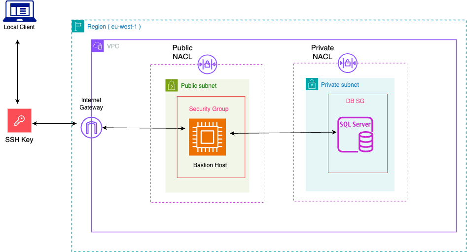

# 🛡️ AWS Bastion Host Stack - CloudFormation Template

This AWS CloudFormation template provisions a **Bastion Host EC2 instance** in a **public subnet** for secure access to resources (e.g., Microsoft SQL Server RDS) deployed in **private subnets**. It integrates with an existing VPC stack by importing subnet and security group values, and includes **IAM roles**, **instance profile**, and **SSM access** to facilitate secure and controlled connectivity.

---

## 📌 Features

- Launches **Bastion Host EC2 instance** in a public subnet
- Uses **Amazon Linux 2 AMI** (region-specific mapping)
- Attaches **IAM role and instance profile** with SSM and S3 access
- Imports **subnet ID** and **security group** from existing VPC stack
- Boots with **UserData script** to install:
  - AWS CLI
  - Microsoft SQL Server Tools (`sqlcmd`)
- Enables **SSM Session Manager** for secure, keyless SSH access
- Outputs **public and private IPs** for reference

## 🧭 Architecture Overview

This stack assumes a VPC (deployed separately) and configures the following within that context:

- ☁️ **EC2 Bastion Host**: Deployed in a public subnet to provide access to private resources.
- 🔐 **IAM Role**: Grants access to AWS Systems Manager and S3, plus custom SSM Parameter permissions.
- 🛠️ **UserData Setup**: Automatically installs tools for managing and accessing SQL Server.
- 📡 **Network Interface**: Associates a public IP and imports required security group.



## 📝 Parameters

Customize the Bastion Host deployment using the parameters below:

### 🔧 Core Configuration

| Parameter                    | Description                            | Type     | Default              | Constraints                        |
|-----------------------------|----------------------------------------|----------|----------------------|------------------------------------|
| `EnvironmentName`           | Name of the environment                | String   | `dev`                | `dev` / `prod` / `test`            |
| `InstanceTypeParam`         | EC2 instance type                      | String   | `t3.micro`           | `t3.micro` to `t3.large`           |
| `BastionHostEC2InstanceName`| Logical name of Bastion instance       | String   | `bastion-host-server`| Valid EC2 name                     |
| `BastionHostSSHKeyPair`     | EC2 SSH key pair name                  | AWS::EC2::KeyPair::KeyName | `bastion-host-key` | Must exist in your account        |
| `VPCName`                   | Name of the target VPC                | String   | `cru-wine-vpc`       | Must match VPC stack               |
| `AvailabilityZone`          | Availability zone for deployment       | AWS::EC2::AvailabilityZone::Name | —        | Typically auto-resolved via subnet |

## 🔐 Security Considerations

- **Public Subnet**: Bastion host is publicly accessible only through tightly scoped security groups and SSH key pairs.
- **IAM Role with Least Privilege**: Access is limited to SSM and optionally S3.
- **SSM Session Manager Ready**: Role includes `AmazonSSMManagedInstanceCore`, so no SSH is needed if SSM is preferred.
- **Parameter Store Access**: IAM role allows secure fetching/storing of sensitive parameters via SSM.

## ⚙️ UserData Configuration

The EC2 instance automatically installs essential tools on boot:

- AWS CLI v2
- Microsoft SQL Server Tools (`sqlcmd`, `bcp`)
- Python 3 & `pip`
- `unzip`, `less`, and other useful CLI tools

This ensures the bastion host is ready to connect to SQL Server databases securely and manage AWS resources.

## 🚀 Usage

Ensure that the **VPC stack is deployed first**, and it exports the following values:

- Public subnet ID: `${EnvironmentName}-${VPCName}-public-subnet2-id`
- Bastion Host Security Group ID: `${EnvironmentName}-${VPCName}-bastion-host-security-group-id`

Then deploy the Bastion Host stack using the AWS Console, CLI, or your CI/CD pipeline.

# 🔐 Connect Azure Data Studio to Private RDS via Bastion Host

This guide explains how to connect **Azure Data Studio** to an **Amazon RDS Microsoft SQL Server** instance in a **private subnet**, using an **EC2 bastion host** in a **public subnet**.

---

## ✅ Prerequisites

- **Bastion Host** is in the public subnet with a **public IP**.
- **RDS SQL Server** is in a private subnet with **no public IP**.
- You have the **SSH private key** for the bastion host.
- **RDS security group** allows inbound traffic on port `1433` **from the bastion host's private IP**.
- **Azure Data Studio** is installed on your **local machine**.

---

## 🧭 Step-by-Step Instructions

### 1. SSH into the Bastion Host

Open a terminal and run:

```bash
ssh -i /path/to/your-key.pem ec2-user@<BASTION_PUBLIC_IP>
```
### 2. Test RDS Connectivity from Bastion Host

From inside the bastion host, run:

```bash
telnet <RDS_ENDPOINT> 1433
```

### 3. Set Up SSH Tunnel from Local Machine

On your **local machine**, run the following command in your terminal:

```bash
ssh -i /path/to/your-key.pem -L 14330:<RDS_ENDPOINT>:1433 ec2-user@<BASTION_PUBLIC_IP>
```

### ✅ Example: Deploy using AWS CLI

```bash
aws cloudformation deploy \
  --template-file bastion.yaml \
  --stack-name my-bastion-host \
  --parameter-overrides \
    EnvironmentName=dev \
    InstanceTypeParam=t3.micro \
    BastionHostEC2InstanceName=bastion-host-server \
    BastionHostSSHKeyPair=bastion-host-key \
    VPCName=cru-wine-vpc \
    AvailabilityZone=eu-west-1a \
  --capabilities CAPABILITY_NAMED_IAM
