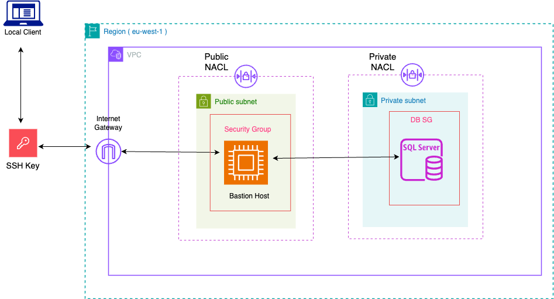

# 🛢️ AWS RDS Stack - CloudFormation Template

This AWS CloudFormation template provisions a **Microsoft SQL Server RDS instance** in private subnets within a secure VPC. It is designed to work seamlessly with the VPC stack by importing private subnet and security group values, making it ideal for production, QA, and development environments requiring secure, managed database infrastructure.

---

## 📌 Features

- Deploys **Microsoft SQL Server** RDS instance (Express, Standard, or Enterprise editions)
- RDS instance runs in **private subnets** for maximum security
- Automatically creates an **RDS Subnet Group**
- Manages access via **imported security groups**
- Uses **AWS Secrets Manager** to manage admin credentials securely
- Supports **CloudWatch log exports** for error monitoring
- Customizable **storage type, instance class, and engine version**
- Outputs key connection and configuration information

## 🧭 Architecture Overview
This RDS stack assumes the existence of a VPC (deployed separately), and builds on top of it by deploying:
- 🧱 **DB Subnet Group**: Aggregates private subnets into a group for RDS to use.
- 🔐 **Security Group**: Controls access, expected to be imported from the VPC stack.
- 🔒 **RDS Instance**: Launched within private subnets with no public accessibility.
- 📊 **Monitoring**: Enables CloudWatch Logs for error insights.



## 📝 Parameters

The following parameters allow you to customize the RDS instance deployment. Most values have sensible defaults but can be overridden during stack creation.

### 🔧 Core Configuration

| Parameter          | Description                      | Type     | Default         | Constraints              |
|--------------------|----------------------------------|----------|-----------------|--------------------------|
| `EnvironmentName`  | Deployment environment name       | String   | `dev`           | `dev` / `qa` / `prod`    |
| `VPCName`          | Name of the target VPC            | String   | `cru-wine-vpc`  | Must match VPC stack     |

### 🛢️ RDS Settings

| Parameter                | Description                          | Type     | Default             | Constraints                        |
|--------------------------|--------------------------------------|----------|---------------------|------------------------------------|
| `DBInstanceIdentifierName` | RDS instance identifier            | String   | `cru-ms-sql-db`     | Unique within account              |
| `DBInstanceClassName`     | Instance class for RDS              | String   | `db.t3.small`       | `db.t3.micro` to `db.t3.2xlarge`   |
| `DBEngineName`            | SQL Server edition                  | String   | `sqlserver-ex`      | `sqlserver-ex`, `se`, or `ee`      |
| `DBEngineVersion`         | SQL Server engine version           | String   | `16.00.4165.4.v1`   | Must match AWS-supported versions  |
| `DBPort`                  | Port for SQL Server                 | Number   | `1433`              | Standard port                      |
| `DBStorageType`           | Storage type                        | String   | `gp3`               | `gp3`, `gp2`, `standard`           |
| `DBAllocatedStorage`      | Initial storage (GB)                | Number   | `30`                | Min: 20, Max: 50                   |
| `MaxDBAllocatedStorage`   | Maximum auto-scaled storage (GB)    | Number   | `50`                | Upper bound                        |
| `DBUsername`              | Admin username                      | String   | —                   | Alphanumeric, starts with a letter |

### 🌐 Network Settings

| Parameter                 | Description                          | Type     | Default                          |
|---------------------------|--------------------------------------|----------|----------------------------------|
| `DatabaseSubnetGroupName` | Logical name for DB Subnet Group     | String   | `cru-ms-sql-db-subnet-group`     |

## 🔐 Security Considerations
- **Private Subnets Only**: RDS is not publicly accessible.
- **Managed Credentials**: Admin password is securely managed by AWS using `ManageMasterUserPassword: true`.
- **Access Control**: Security groups are imported from the VPC stack and should allow only specific trusted resources (e.g., Lambda functions, Bastion host).
- **Logging Enabled**: Error logs are exported to Amazon CloudWatch for monitoring and auditing.

## 🚀 Usage
Deploy the RDS stack via the **AWS Console**, **AWS CLI**, or **CI/CD** tools. Ensure the VPC stack is deployed first and exports necessary values like subnet and security group IDs.

### ✅ Example: Deploy using AWS CLI

```bash
aws cloudformation deploy \
  --template-file rds.yaml \
  --stack-name my-rds-stack \
  --parameter-overrides \
    EnvironmentName=dev \
    VPCName=cru-wine-vpc \
    DBInstanceIdentifierName=cru-ms-sql-db \
    DBInstanceClassName=db.t3.small \
    DBEngineName=sqlserver-ex \
    DBEngineVersion=16.00.4165.4.v1 \
    DBPort=1433 \
    DBStorageType=gp3 \
    DBAllocatedStorage=30 \
    MaxDBAllocatedStorage=50 \
    DatabaseSubnetGroupName=cru-ms-sql-db-subnet-group \
    DBUsername=adminuser \
  --capabilities CAPABILITY_NAMED_IAM
