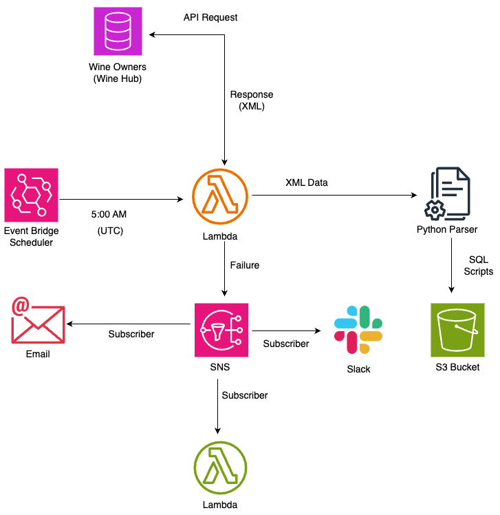

# Automated Data Extraction and Transformation Workflow

## Overview

This project automates the daily extraction of data from the Wine Owners (Wine Hub) API, transforms the response into SQL scripts, and stores the output in an Amazon S3 bucket. The entire workflow is triggered automatically at a scheduled time using Amazon EventBridge.

---

## Architecture Diagram

---

## Components and Workflow

### 1. EventBridge Scheduler

- **Function**: Triggers the AWS Lambda function on a daily schedule.
- **Schedule**: Every day at **5:00 AM UTC**.

### 2. AWS Lambda

- **Triggered by**: EventBridge Scheduler.
- **Responsibilities**:
  - Sends an API request to the Wine Owners (Wine Hub) database.
  - Receives the response in **XML format**.
  - Sends the XML data to a Python parser for processing.

### 3. Wine Owners (Wine Hub)

- **Role**: External data source.
- **Function**: Responds to API calls with data in XML format.

### 4. Python Parser

- **Input**: Receives XML data from Lambda.
- **Process**:
  - Parses the XML.
  - Generates corresponding **SQL scripts**.

### 5. Amazon S3

- **Function**: Stores the generated SQL scripts for further processing or archival.

---

## Purpose

This automated workflow ensures reliable, daily retrieval and transformation of external data. It improves operational efficiency by eliminating manual steps and enabling integration with downstream systems through standardized SQL script output.

---

## Requirements

- AWS Lambda
- Amazon EventBridge
- Amazon S3
- Wine Owners API access
- Python (for parsing logic)

