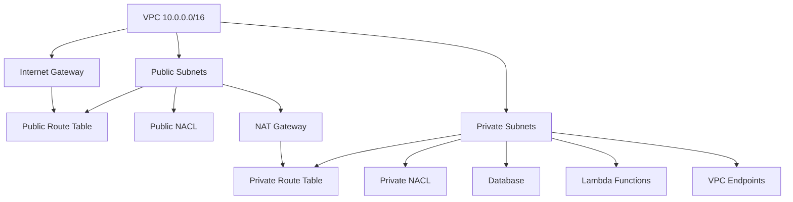

# 🏗️ AWS VPC Stack - CloudFormation Template

This AWS CloudFormation template provisions a **highly-available and secure Virtual Private Cloud (VPC)** that spans across three Availability Zones. The stack is ideal for environments that require both public-facing and private workloads (e.g., Lambda functions, databases, and EC2 Bastion hosts).

---

## 📌 Features

- Custom VPC with user-defined CIDR
- 3 Public Subnets (spread across AZs)
- 3 Private Subnets (spread across AZs)
- Internet Gateway (IGW) for outbound internet access
- NAT Gateway with Elastic IP for internet access from private subnets
- Route Tables for both public and private subnets
- Network ACLs (Access Control Lists) for public and private layers
- Security Groups for:
  - Lambda functions
  - Data Poller Lambda
  - Bastion host
  - Database
- VPC Endpoints for private access to AWS services (SSM, S3, SQS, Secrets Manager, etc.)

## 🧭 Architecture Overview

The VPC stack deploys the following components:

### 🌐 Public Layer:
- **Internet Gateway**: Provides internet access for public resources.
- **Public Subnets (x3)**: Subnets exposed to the internet for resources like load balancers.
- **Route Table**: Configured with a route to the Internet Gateway.
- **Network ACL**: Allow rules for HTTP, HTTPS, and SSH traffic.

### 🔒 Private Layer:
- **NAT Gateway**: Provides outbound internet access for private resources (with Elastic IP in one AZ).
- **Private Subnets (x3)**: Subnets not directly exposed to the internet for resources like databases.
- **Route Table**: Routes traffic through the NAT Gateway for internet access.
- **Network ACL**: Restricted ingress/egress for better security.

### 🔗 Connectivity:
- **VPC Endpoints**: Allows secure communication with AWS services (SSM, SQS, Secrets Manager, etc.) without public internet.
- **Security Groups**: Assigned to Lambda, Bastion, and RDS for access control and security.

This setup ensures a secure, scalable, and highly available network architecture for your resources.

## Architecture Diagram


---
## 📝 Parameters

The following parameters allow customization of the VPC deployment. All parameters have sensible defaults but can be overridden during stack creation.

### Core Configuration

| Parameter          | Description                               | Type        | Default       | Constraints              |
|--------------------|-------------------------------------------|-------------|---------------|--------------------------|
| `EnvironmentName`  | Deployment environment (e.g., dev/prod)   | `String`    | `dev`         | `dev`/`qa`/`prod`        |
| `VPCName`          | Logical name for the VPC                  | `String`    | `app-vpc`     | Max 64 chars             |
| `VpcCidr`         | Primary CIDR block for the VPC            | `String`    | `10.0.0.0/16` | Valid IPv4 CIDR format   |

### Public Subnets

| Parameter        | Description                     | Type     | Default       | Constraints              |
|------------------|---------------------------------|----------|---------------|--------------------------|
| `PublicSubnet1` | Public subnet in AZ1            | `String` | `10.0.0.0/24` | Must be within VpcCidr   |
| `PublicSubnet2` | Public subnet in AZ2            | `String` | `10.0.1.0/24` | Must be within VpcCidr   |
| `PublicSubnet3` | Public subnet in AZ3            | `String` | `10.0.2.0/24` | Must be within VpcCidr   |

### Private Subnets

| Parameter         | Description                     | Type     | Default         | Constraints              |
|-------------------|---------------------------------|----------|-----------------|--------------------------|
| `PrivateSubnet1` | Private subnet in AZ1           | `String` | `10.0.100.0/24` | Must be within VpcCidr   |
| `PrivateSubnet2` | Private subnet in AZ2           | `String` | `10.0.101.0/24` | Must be within VpcCidr   |
| `PrivateSubnet3` | Private subnet in AZ3           | `String` | `10.0.102.0/24` | Must be within VpcCidr   |

### Usage Notes
- 🔹 All subnet CIDRs must be unique and non-overlapping
- 🔹 `/24` subnet masks recommended (251 usable IPs)
- 🔹 AZ placement is automatically managed by AWS
- 🔹 EnvironmentName propagates to all resource tags

---

## 🔐 Security Considerations

- **Least Privilege**: Security Groups and NACLs are locked down to required ports only.
- **Isolation**: Public and private resources are logically separated and governed by separate route tables and ACLs.
- **Endpoint Access**: Use of VPC endpoints ensures private connectivity to AWS services without traversing the public internet.
- **Bastion Access**: Only allow SSH from trusted IPs via the Bastion host in the public subnet.

---
## 🚀 Usage

You can deploy the stack using the **AWS Management Console**, **AWS CLI**, or via **CI/CD pipelines** (e.g., GitHub Actions, CodePipeline).

### ✅ Example: Deploy using AWS CLI

```bash
aws cloudformation deploy \
  --template-file vpc-stack.yaml \
  --stack-name my-vpc-stack \
  --parameter-overrides \
    EnvironmentName=dev \
    VPCCIDR=10.0.0.0/16 \
    PublicSubnetCIDRs='["10.0.1.0/24","10.0.2.0/24","10.0.3.0/24"]' \
    PrivateSubnetCIDRs='["10.0.101.0/24","10.0.102.0/24","10.0.103.0/24"]' \
  --capabilities CAPABILITY_NAMED_IAM
