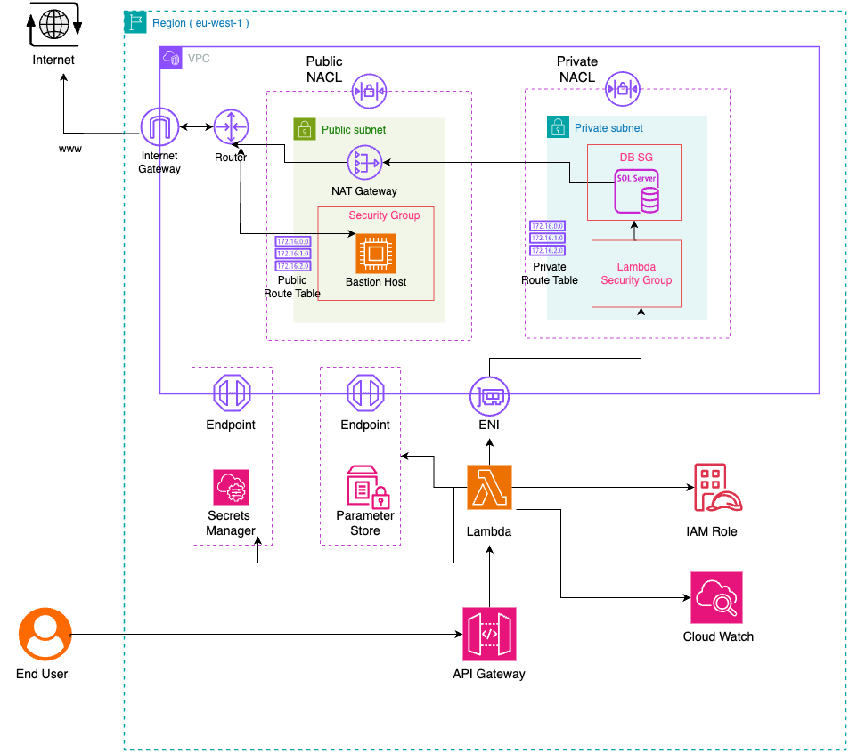

# 🛠️ AWS CloudFormation Modular Infrastructure

This project provides a modular and environment-specific infrastructure-as-code setup using **AWS CloudFormation**. It includes reusable templates and parameter files for deploying and managing common AWS resources such as VPC, RDS, Bastion Host, EventBridge, and SNS topics across multiple environments (`dev`, `qa`, `prod`).

## 📦 Features

- Modular CloudFormation templates for core infrastructure components
- Environment-specific parameterization (dev, qa, prod)
- Deployment scripts for automation
- Architecture diagrams and stack-level documentation
- Clean and extensible folder structure

---

## 📁 Folder Structure

```
cru-wine-aws-infrastructure
├── configs
│   ├── dev
│   │   ├── bastionhost-parameters.json
│   │   ├── db-parameters.json
│   │   ├── eventbridge-parameters.json
│   │   └── vpc-parameters.json
│   ├── prod
│   │   ├── bastionhost-parameters.json
│   │   ├── db-parameters.json
│   │   ├── eventbridge-parameters.json
│   │   └── vpc-parameters.json
│   └── qa
│       ├── bastionhost-parameters.json
│       ├── db-parameters.json
│       ├── eventbridge-parameters.json
│       └── vpc-parameters.json
├── description.text
├── docs
│   ├── architecture-diagram
│   │   ├── BastionHost.drawio.png
│   │   ├── eventbridge.drawio.png
│   │   └── VPC1.drawio.png
│   ├── bastionhost
│   │   └── README.md
│   ├── database
│   │   └── README.md
│   ├── eventbridge
│   │   ├── README.md
│   │   └── workflow.md
│   └── vpc
│       └── README.md
├── LICENSE
├── scripts
│   ├── dev-vpc-rds-deploy.sh
│   └── eventBridge.sh
└── templates
    ├── bastionhost.yaml
    ├── db.yaml
    ├── eventbridge.yaml
    ├── snstopic.yaml
    └── vpc.yaml
```

### 🔧 Templates
CloudFormation templates located in the `templates/` folder:
- `vpc.yaml`
- `db.yaml` (RDS for SQL Server)
- `bastionhost.yaml`
- `eventbridge.yaml`
- `snstopic.yaml`

### 🌐 Configs
Parameter files for each environment:
- `configs/dev/`
- `configs/qa/`
- `configs/prod/`

Each contains:
- `vpc-parameters.json`
- `db-parameters.json`
- `bastionhost-parameters.json`
- `eventbridge-parameters.json`

### 📄 Docs
Documentation and diagrams:
- Stack-specific `README.md` files in `docs/<stack>/`
- Workflow diagrams and `.drawio.png` files in `docs/architecture-diagram/`

---

## 🚀 Getting Started

### Prerequisites
- AWS CLI configured with appropriate credentials
- CloudFormation IAM permissions
- (Optional) [AWS SAM CLI](https://docs.aws.amazon.com/serverless-application-model/latest/developerguide/serverless-sam-cli-install.html) if you use it for deployment

## 🧭 Architecture

You can find the architecture diagrams in `docs/architecture-diagram/`.  
These include visual representations of:

- Bastion Host setup  
- VPC layout setup
- EventBridge flow

The VPC stack deploys the following components:

### 🌐 Public Layer:
- **Internet Gateway**: Provides internet access for public resources.
- **Public Subnets (x3)**: Subnets exposed to the internet for resources like load balancers.
- **Route Table**: Configured with a route to the Internet Gateway.
- **Network ACL**: Allow rules for HTTP, HTTPS, and SSH traffic.

### 🔒 Private Layer:
- **NAT Gateway**: Provides outbound internet access for private resources (with Elastic IP in one AZ).
- **Private Subnets (x3)**: Subnets not directly exposed to the internet for resources like databases.
- **Route Table**: Routes traffic through the NAT Gateway for internet access.
- **Network ACL**: Restricted ingress/egress for better security.

### 🔗 Connectivity:
- **VPC Endpoints**: Allows secure communication with AWS services (SSM, SQS, Secrets Manager, etc.) without public internet.
- **Security Groups**: Assigned to Lambda, Bastion, and RDS for access control and security.

This setup ensures a secure, scalable, and highly available network architecture for your resources.

## Architecture Diagram


## 📚 Documentation

Each infrastructure component has its own README file:

- [docs/vpc/README.md](docs/vpc/README.md)
- [docs/database/README.md](docs/database/README.md)
- [docs/bastionhost/README.md](docs/bastionhost/README.md)
- [docs/eventbridge/README.md](docs/eventbridge/README.md)


### Deploying a Stack

```bash
# Example: Deploy VPC stack in dev environment
aws cloudformation deploy \
  --template-file templates/vpc.yaml \
  --stack-name dev-vpc \
  --parameter-overrides file://configs/dev/vpc-parameters.json \
  --capabilities CAPABILITY_NAMED_IAM
